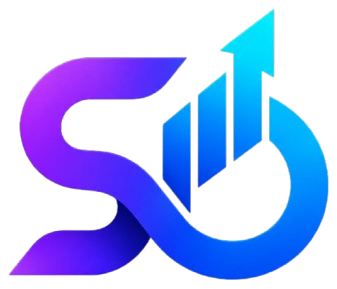

# ALZO Tech — Modern Digital Growth Partner

<div align="center">
  
  
  <h3><strong>We Innovate, You Elevate</strong></h3>
  <p><em>Build. Automate. Get Found. Grow.</em></p>

  <p>
    <a href="#key-features">Key Features</a> •
    <a href="#growth-systems">Growth Systems</a> •
    <a href="#tech-stack">Tech Stack</a> •
    <a href="#getting-started">Getting Started</a> •
    <a href="#project-structure">Project Structure</a> •
    <a href="#brand-pillars">Brand Pillars</a>
  </p>
</div>

---

## 🚀 Overview

**ALZO Tech** is a next-generation digital growth partner for ambitious businesses. We build interconnected digital systems engineered to eliminate operational friction, command search discoverability, and turn digital activity into compounding commercial growth.

- **Fast & Reliable**: Sub-second loading speeds, responsive layouts, and 100/100 Core Web Vitals.
- **Autonomous Operations**: 24/7 AI-driven lead capture and WhatsApp automation pipelines.
- **Organic Discovery**: Google Maps Local 3-Pack domination and semantic SEO architecture.
- **Full-Funnel Analytics**: Real-time conversion tracking and compounding growth telemetry.

---

## ✨ Key Features & Interactive Modules

1. **Kinetic Hero with 3D Parallax Telemetry**:
   - Dynamic headline switcher cycling through *BUILD*, *AUTOMATE*, *GET FOUND*, and *GROW*.
   - Interactive 3D tilt card simulating live growth telemetry and performance metrics.

2. **The 4-Stage Interactive Growth Journey**:
   - Step-by-step interactive progression demonstrating how businesses scale from baseline foundations to autonomous expansion.

3. **Autonomous AI & Workflow Simulation**:
   - Live simulated pipeline demonstrating multi-agent customer triage, instant WhatsApp response, and automated CRM record synchronization.

4. **Search & Local Maps Dominance Radar**:
   - Interactive showcase detailing technical schema markup, Google Maps Local Pack positioning, and buyer-intent keyword capture.

5. **Case Studies & Project Detail Modal**:
   - Deep-dive case studies covering bespoke MSME architectures, high-converting e-commerce flagships, and autonomous AI customer portals.

6. **Interactive Project Inquiry Engine**:
   - Tailored multi-step questionnaire with dynamic scope selection, budget indicators, and instant validation.

7. **Bespoke Luxury Aesthetics**:
   - Clean light luxury design system featuring subtle glassmorphism, tailored gradients, smooth micro-interactions, and custom desktop cursor.

---

## ⚡ Four Growth Systems

| System | Focus Area | Impact |
| :--- | :--- | :--- |
| **01. Web & Digital Flagships** | Headless React, Next-Gen UX, Sub-600ms load | Maximum visitor engagement & zero drop-off |
| **02. AI & WhatsApp Automation** | Multi-agent workflows, instant lead qualification | 24/7 autonomous conversion without manual triage |
| **03. Google Maps & SEO Discovery** | Local 3-Pack, Technical SEO, Rich Schemas | High-intent organic customer capture |
| **04. Performance Funnels & Scale** | Telemetry, checkout optimization, CRM integration | Compounding long-term revenue growth |

---

## 💎 Brand Core Pillars

```
S (Smart) + D (Driven) + Growth (||||) + Elevate (↗) = ALZO
```

- **INNOVATE**: We create smart solutions that simplify complex operational friction.
- **ELEVATE**: We help you grow beyond limits with compounding digital leverage.
- **DRIVEN**: We are passionate, accountable, and hyper-focused on measurable outcomes.
- **TRUSTED PARTNER**: Your sustained success is our mission from launch through continuous scale.

---

## 🛠️ Tech Stack

- **Core**: [React 19](https://react.dev/), [TypeScript](https://www.typescriptlang.org/)
- **Bundler & Tooling**: [Vite](https://vitejs.dev/)
- **Styling**: [Tailwind CSS](https://tailwindcss.com/), [PostCSS](https://postcss.org/), [Autoprefixer](https://github.com/postcss/autoprefixer)
- **Icons**: [Lucide React](https://lucide.dev/)
- **Typography**: Plus Jakarta Sans, Space Grotesk, JetBrains Mono

---

## 📂 Project Structure

```bash
ALZOTech/
├── public/                     # Static assets & multi-size favicons
│   ├── favicon.svg             # Transparent SVG favicon
│   ├── favicon.png             # 512x512 PNG favicon
│   ├── favicon-64.png          # 64x64 PNG favicon
│   ├── favicon-32.png          # 32x32 PNG favicon
│   ├── logo.png                # Official transparent logo
│   ├── robots.txt              # Search crawler directives
│   └── sitemap.xml             # XML Sitemap
├── src/
│   ├── assets/                 # Component assets
│   │   └── logo.png            # Transparent brand mark
│   ├── components/             # Modular UI components
│   │   ├── About.tsx           # Brand philosophy & 4 capability pillars
│   │   ├── CaseStudyModal.tsx  # Interactive case study deep-dive
│   │   ├── ContactSection.tsx  # Multi-tier inquiry & contact system
│   │   ├── CTASection.tsx      # High-impact closing call-to-action
│   │   ├── CustomCursor.tsx    # Magnetic desktop custom pointer
│   │   ├── Footer.tsx          # Luxury footer with systems telemetry
│   │   ├── GrowthSection.tsx   # Revenue telemetry & analytics
│   │   ├── Hero.tsx            # Kinetic headline & 3D tilt engine
│   │   ├── Insights.tsx        # Articles & growth strategy insights
│   │   ├── InteractiveJourney.tsx # 4-stage signature growth roadmap
│   │   ├── Logo.tsx            # Master transparent SVG/PNG Logo component
│   │   ├── Navbar.tsx          # Floating glassmorphic navigation
│   │   ├── Portfolio.tsx       # Flagship projects & case studies
│   │   ├── Process.tsx         # 4-step execution timeline
│   │   ├── Services.tsx        # Four core growth systems
│   │   ├── TrustStrip.tsx      # Social proof & metric badges
│   │   ├── VisibilitySection.tsx # Google Maps & Search radar
│   │   ├── WhyAlzo.tsx         # 4 core operating values
│   │   └── WorkflowShowcase.tsx # Autonomous AI workflow simulator
│   ├── data/                   # Structured data models
│   ├── types/                  # TypeScript interface definitions
│   ├── App.tsx                 # Root application composition
│   ├── index.css               # Design system tokens & utility classes
│   └── main.tsx                # React DOM root entry point
├── index.html                  # HTML5 shell & SEO meta configuration
├── package.json                # Project dependencies & scripts
├── tailwind.config.js          # Custom theme extensions & brand palettes
├── tsconfig.json               # TypeScript compiler options
└── vite.config.ts              # Vite configuration
```

---

## 💻 Getting Started

### Prerequisites
- [Node.js](https://nodejs.org/) (version 18+ recommended)
- `npm`, `pnpm`, or `yarn`

### Installation

1. Clone or open the repository:
   ```bash
   git clone https://github.com/alzotech/alzotech.git
   cd alzotech
   ```

2. Install dependencies:
   ```bash
   npm install
   ```

3. Start the local development server:
   ```bash
   npm run dev
   ```
   Open [http://localhost:5174](http://localhost:5174) in your browser.

4. Build for production:
   ```bash
   npm run build
   ```

5. Preview production build:
   ```bash
   npm run preview
   ```

---

## 🎨 Brand Guidelines & Logo Usage

- **Primary Logo**: Located at [`src/assets/logo.png`](file:///e:/ALZOTech/src/assets/logo.png) (Transparent PNG).
- **Favicon Formats**: Multi-resolution favicons located in [`public/`](file:///e:/ALZOTech/public/).
- **Component**: Import `<Logo size="md" showTagline={true} />` from [`src/components/Logo.tsx`](file:///e:/ALZOTech/src/components/Logo.tsx).

---

## 📄 License

© 2026 ALZO Tech. All rights reserved.
